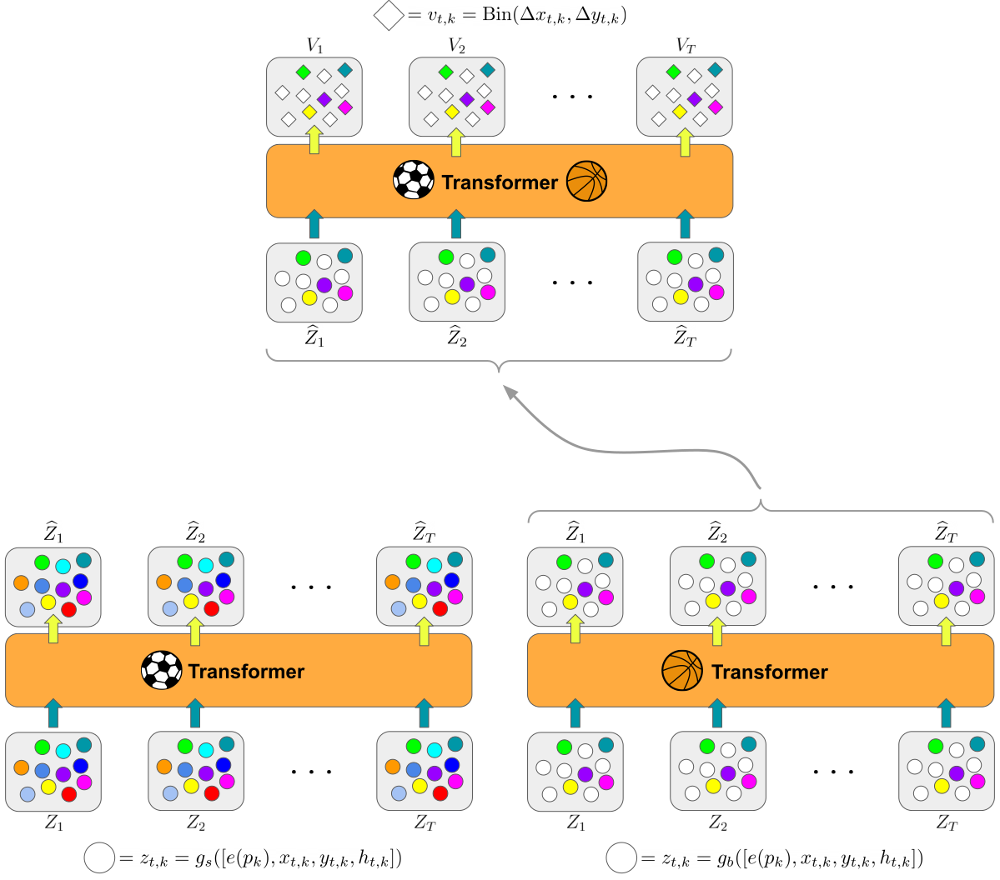

# The Boformer

|  |
|:--|
| The Boformer extends `baller2vec++` in three important ways: (1) it adapts the input of `baller2vec++` so that it can handle the different number of players participating in basketball vs. soccer, (2) it splits the model into sport-specific and shared Transformer components, and (3) it provides a mechanism for handling time steps in a sequence where players are missing, which was common in the soccer dataset. For (1), the Boformer fixes the size of the number of inputs at each time step to 22 (i.e., the number of players participating in a soccer match), and uses separate Transformers to initially process basketball vs. soccer player inputs (i.e., player identities and locations). For soccer data, the inputs to the Boformer are thus the same as in `baller2vec++`; however, for basketball data, the Boformer "fills in" the extra 12 inputs at each time step with a constant feature vector. For (3), the Boformer both processes the missing players with a separate multilayer perceptron (MLP) and masks the outputs for the missing players when backpropagating the error signal. |

Research on jointly modeling the trajectories of athletes in team sports has made steady progress over the past several years.
However, universally, these models were trained on only a single sport at a time. Athleticism is known to translate across sports, with multi-sport athletes being common at the high school level (before specialization is necessary).
Additionally, certain team dynamics, e.g., a ball handler passing to an open teammate, or multiple defenders converging onto the opposing team’s star player, are shared between sports.
In this repository, I investigate whether such commonalities in sports can be exploited (i.e., through transfer learning) to improve the performance of a trajectory model on a single sport.
Specifically, I extend `baller2vec++`—a recently described multi-entity Transformer—so that it can be jointly trained on basketball and soccer datasets.
I call this model "the Boformer" in honor of two-sport All-Star Bo Jackson.
I find that, when evaluated separately on each sport, the Boformer achieves similar performance to models trained on each sport independently, which suggests that, at least for this particular architecture and dataset, jointly training the model was not advantageous.

## Training the Boformer

### Setting up `.boformer_profile`

After you've cloned the repository to your desired location, create a file called `.boformer_profile` in your home directory:

```bash
nano ~/.boformer_profile
```

and copy and paste in the contents of [`.boformer_profile`](.boformer_profile), replacing each of the variable values with paths relevant to your environment.
Next, add the following line to the end of your `~/.bashrc`:

```bash
source ~/.boformer_profile
```

and either log out and log back in again or run:

```bash
source ~/.bashrc
```

You should now be able to copy and paste all of the commands in the various instructions sections.
For example:

```bash
echo ${PROJECT_DIR}
```

should print the path you set for `PROJECT_DIR` in `.boformer_profile`.

### Installing the necessary Python packages

```bash
cd ${PROJECT_DIR}
pip3 install --upgrade -r requirements.txt
```

### Organizing the play-by-play and tracking data

1) Copy `events.zip` (which I acquired from [here](https://github.com/sealneaward/nba-movement-data/tree/master/data/events) \[mirror [here](https://github.com/airalcorn2/nba-movement-data/tree/master/data/events)\] using https://downgit.github.io) to the `DATA_DIR` directory and unzip it:

```bash
mkdir -p ${DATA_DIR}
cp ${PROJECT_DIR}/events.zip ${DATA_DIR}
cd ${DATA_DIR}
unzip -q events.zip
rm events.zip
```

Descriptions for the various `EVENTMSGTYPE`s can be found [here](https://github.com/rd11490/NBA_Tutorials/tree/master/analyze_play_by_play) (mirror [here](https://github.com/airalcorn2/NBA_Tutorials/tree/master/analyze_play_by_play)).

2) Clone the basketball tracking data from [here](https://github.com/linouk23/NBA-Player-Movements) (mirror [here](https://github.com/airalcorn2/NBA-Player-Movements)) to the `DATA_DIR` directory:

```bash
cd ${DATA_DIR}
git clone git@github.com:linouk23/NBA-Player-Movements.git
```

A description of the tracking data can be found [here](https://danvatterott.com/blog/2016/06/16/creating-videos-of-nba-action-with-sportsvu-data/).

### Generating the training data

```bash
cd ${PROJECT_DIR}
nohup python3 generate_game_numpy_arrays.py > games.log &
nohup python3 generate_match_numpy_arrays.py > matches.log &
```

You can monitor its progress with:

```bash
top
```

or:

```bash
ls -U ${GAMES_DIR} | wc -l
ls -U ${MATCHES_DIR} | wc -l
```

For the basketball dataset, there should be 1,262 NumPy arrays (corresponding to 631 X/y pairs) when finished.
For the soccer dataset, there should be 280 NumPy arrays when finished.

### Running the training script

Run (or copy and paste) the following script, editing the variables as appropriate.

```bash
#!/usr/bin/env bash

JOB=$(date +%Y%m%d%H%M%S)

echo "train:" >> ${JOB}.yaml
echo "  use_basketball: True" >> ${JOB}.yaml
echo "  use_soccer: True" >> ${JOB}.yaml
echo "  train_valid_prop: 0.95" >> ${JOB}.yaml
echo "  train_prop: 0.95" >> ${JOB}.yaml
echo "  train_samples_per_epoch: 20000" >> ${JOB}.yaml
echo "  samps_per_valid_id: 34" >> ${JOB}.yaml
echo "  samps_per_test_id: 32" >> ${JOB}.yaml
echo "  workers: 10" >> ${JOB}.yaml
echo "  learning_rate: 1.0e-5" >> ${JOB}.yaml
echo "  patience: 20" >> ${JOB}.yaml

echo "dataset:" >> ${JOB}.yaml
echo "  hz: 5" >> ${JOB}.yaml
echo "  secs: 4.2" >> ${JOB}.yaml
echo "  player_traj_n: 11" >> ${JOB}.yaml
echo "  max_player_move: 4.5" >> ${JOB}.yaml

echo "model:" >> ${JOB}.yaml
echo "  embedding_dim: 30" >> ${JOB}.yaml
echo "  sigmoid: none" >> ${JOB}.yaml
echo "  mlp_layers: [192, 384, 768]" >> ${JOB}.yaml
echo "  nhead: 12" >> ${JOB}.yaml
echo "  dim_feedforward: 3072" >> ${JOB}.yaml
echo "  num_layers: 12" >> ${JOB}.yaml
echo "  dropout: 0.0" >> ${JOB}.yaml

# Save experiment settings.
mkdir -p ${EXPERIMENTS_DIR}/${JOB}
mv ${JOB}.yaml ${EXPERIMENTS_DIR}/${JOB}/

gpu=0
cd ${PROJECT_DIR}
nohup python3 train_boformer.py ${JOB} ${gpu} > ${EXPERIMENTS_DIR}/${JOB}/train.log &
```
